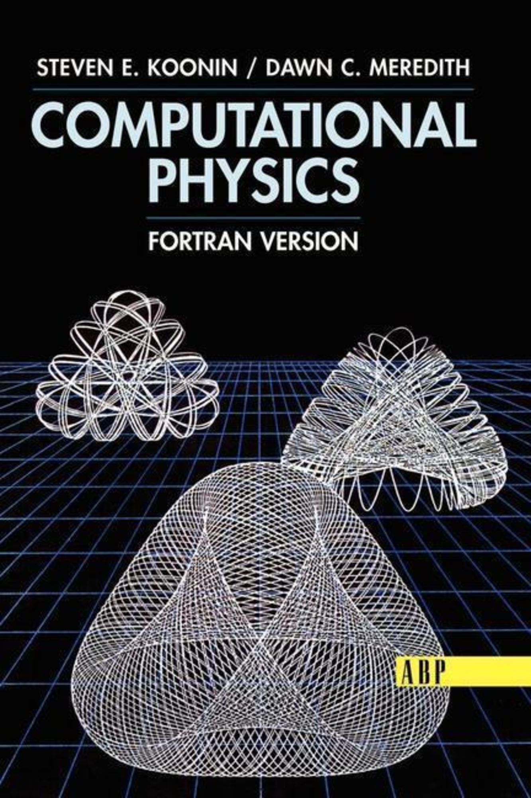

# Computational Physics (Fortran Version) by Steven E. Koonin and Dawn C. Meredith

## Introduction
This is a important textbook of computational for scientific and enginers. It is divide into in two parts; numerical methods and Fortran's program. In first part, the author discutes the aspects of the numerical methods with derivatives equations, codes Fortran examples, exercises, and projects. In second part, we have the complete solution of the projects in Fortran 77. In addition, we have the profissional structure of a project, including a menu iterative in CLI.

## Update Fortran version
In this repository, I'm updating for modern versions of Fortran, i.e., Fortran 90 pattern. Indeed, I'm including Gnuplot templates and configuration of the makefile. More details in 'Book_Computational_Physics-Koonin/Semiclassical_quantization_of_molecular_vibrations/Instructions.pdf'

